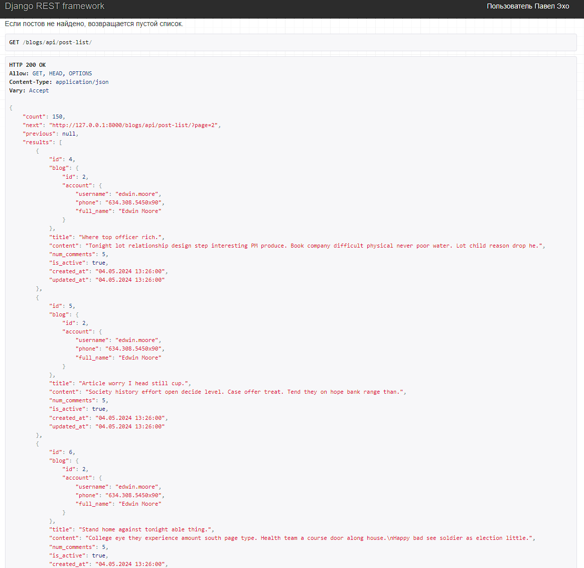
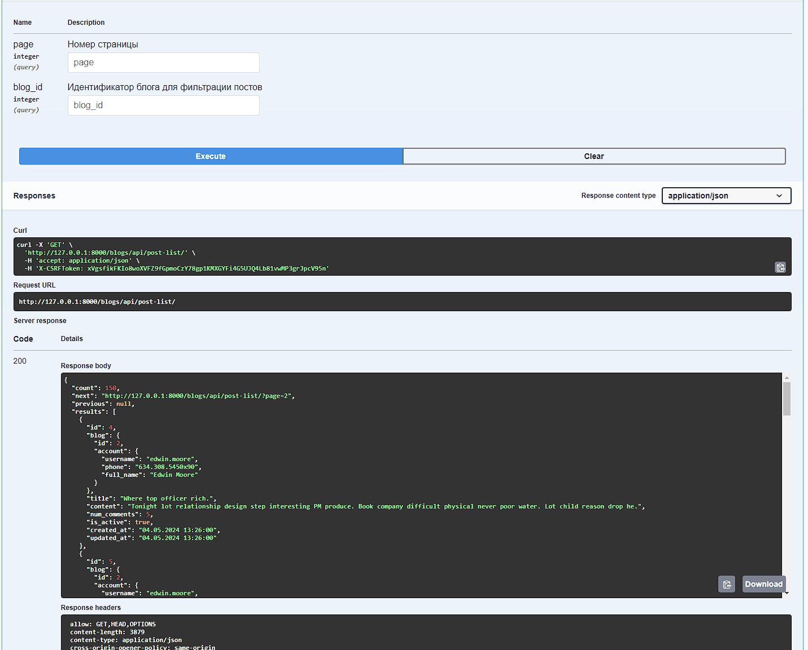
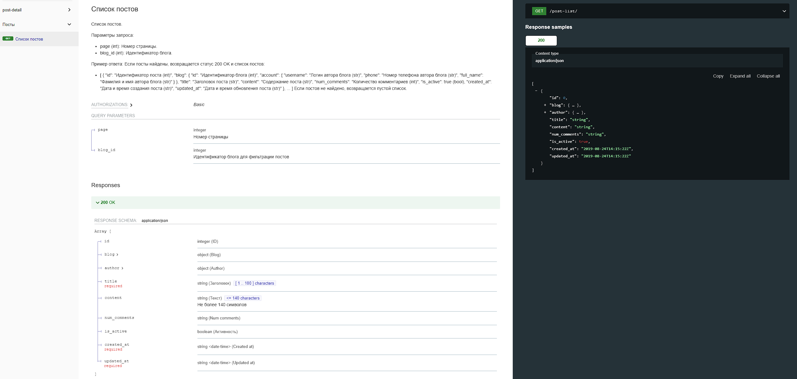
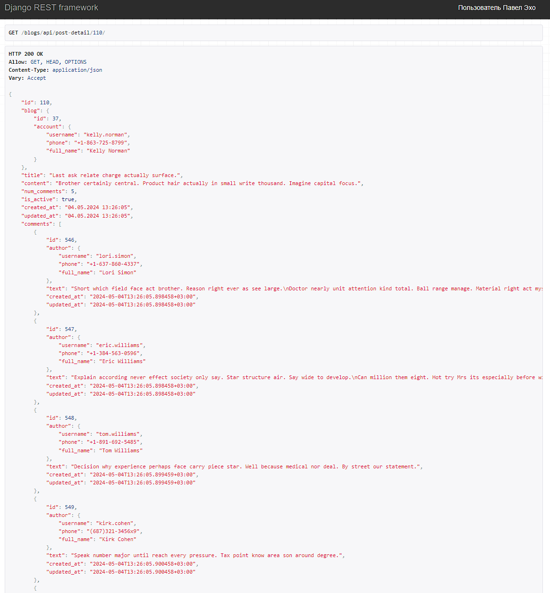
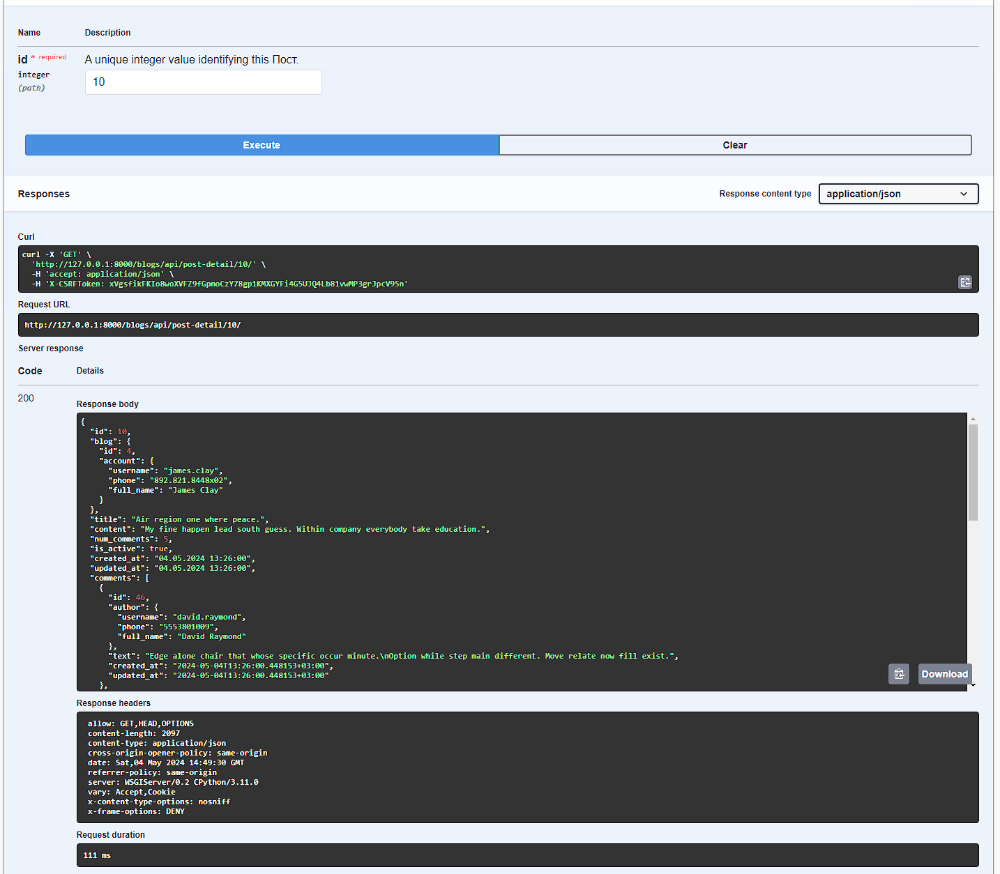
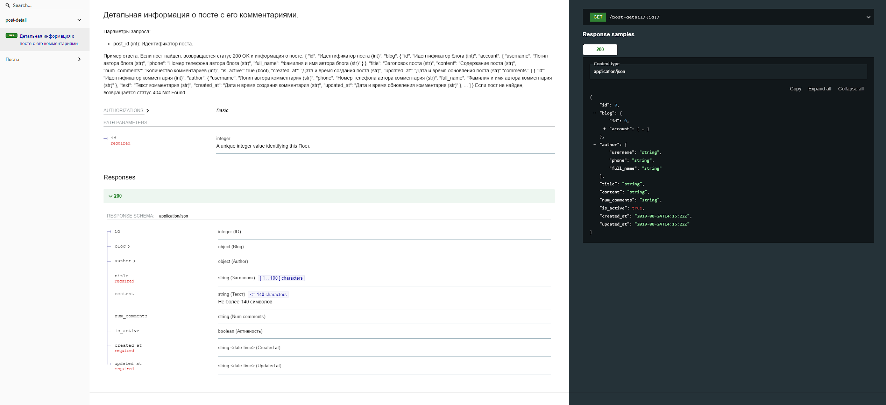
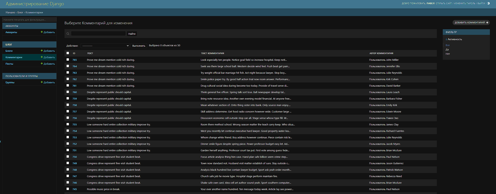
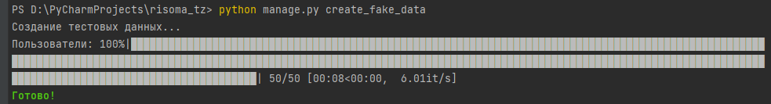
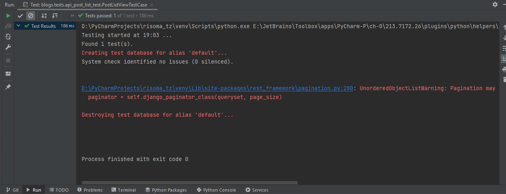
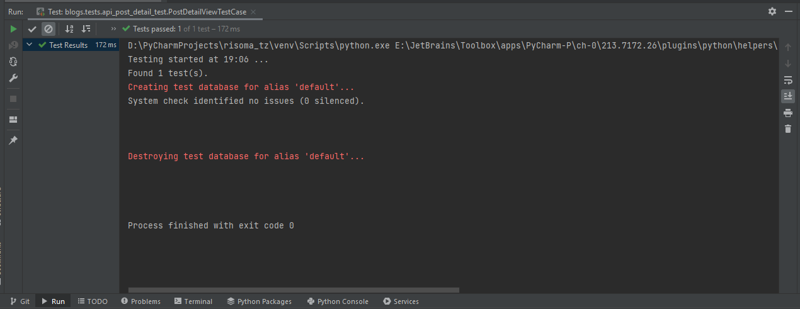

# Описание задачи

Написать приложение на Django + DRF

Основные требования:
1. Реализовать систему моделей для блогов (поля на своё усмотрение)
2. Реализовать систему моделей комментариев к постам для блогам (поля на своё усмотрение)
3. Реализовать эндпойнт, который отдаст в формате json данные в виде списка постов с пагинацией и с информацией о кол-ве комментариев.
4. Реализовать эндпойнт, который отдаст в формате json данные по каждому посту с комментариями

Дополнительные условия (на усмотрение разработчика):
1. Реализовать автогенерацию документации и swagger
2. Реализовать автотестирование функционала для проверки отказоустойчивости системы
3. Реализовать менеджеры по заполенению БД
4. Реализовать админ панель для менеджеров с возможностью просмотра, поиска и фильтрации постов и блогов


Настоящая инструкция предусматривает развертывание проекта в локальном сегменте и через docker


Для работы проекта потребуются:

- Python
- Django
- Postgresql
- DRF

# Реализация

В реализацию тестового задания вложено следующее:
- API;
- swagger;
- фабрики;
- документация;
- автотестирование API;
- удобная админ-панель;
- менеджеры для загрузки данных в БД;
- docker.

### API, swagger, документация
1. API для представления данных о списке существующих постов с пагинацией в формате json и с информацией о кол-ве комментариев к посту.
- Проверить работу API можно по урлу http://127.0.0.1:8000/blogs/api/post-list/
- Также можно воспользоваться swagger по урлу http://127.0.0.1:8000/swagger/
- Также можно по урлу http://127.0.0.1:8000/redoc/#tag/Posty/operation/post-list_list
- Дополнительное, помимо параметра `page`, добавлена возможность фильтроваться по идентификатору блога (`blog_id`)







2. API для представления данных о каждом отдельном посте с комментариями в формате json
- Проверить работу API можно по урлу http://127.0.0.1:8000/blogs/api/post-detail/{id}/
- Также можно воспользоваться swagger по урлу http://127.0.0.1:8000/swagger/
- Также можно по урлу http://127.0.0.1:8000/redoc/#tag/post-detail








#### Админ-панель, менеджеры
1. Админ-панель для представления данных для персонала
- Человекопонятное представление данных с некоторыми тулсами для удобства
- Применяются автокомплиты на FK связи для оптимизации



2. Менеджер для загрузки тестовых данных в базу данных
- Запустить команду в консоли `python manage.py create_fake_data`
- Для генерации данных используются фабрики
- Можно опционально вызвать параметры загрузки данных, это тоже предусмотрено. По дефолту: 50 юзеров, по 1 блогу на юзера, по 3 поста к блога, по 5 комментариев к посту.



### Автотестирование, фабрики
1. Тестируется "ручка" на предмет получения списка постов и проверки на целостность структуры данных (сетапы устанавливаются с помощью фабрик)
- Запустить команду `python manage.py test blogs.tests.api_post_list_test`



2. Тестируется "ручка" на предмет получения деталей поста с комментариями и проверкой структуры данных (сетапы также устанавливаются с помощью фабрик)
- Запустить команду `python manage.py test blogs.tests.api_post_detail_test`




### Запуск проекта локально или через docker (на ваше усмотрение)
1. Клонировать проект:
    ```
    git clone https://github.com/EchoFoe/risoma_tz.git
    ```
2. Создайте виртуальное окружение в корне проекта (зависит от вашей ОС) и установите зависимости
    ```
    pip install -r requirements.txt
    ```
3. Создайте БД (postgres), отредактируйте файл `.env`, при этом не забудьте создать его в корне проекта (использует python-dotenv) в корне проекта и укажите свои конфиги
    ```
    DB_NAME=your_db_name
    DB_USER=your_db_user
    DB_PASSWORD=your_db_pass
    DB_HOST=your_db_host
    DB_PORT=your_db_port
   
    SECRET_KEY=your_django_secret_key
   
    DB_NAME_DOCKER=your_db_name_docker
    DB_USER_DOCKER=your_db_user_docker
    DB_PASSWORD_DOCKER=your_db_pass_docker
    DB_HOST_DOCKER=your_db_host_docker
    DB_PORT_DOCKER=your_db_port_docker
   ```
4. Создайте суперпользователя:
    ```
    python manage.py createsuperuser 
    ```
5. Произведите миграции:
    ```
    python manage.py migrate 
    ```
6. Заполните БД данными с помощью менеджера:
    ```
    python manage.py create_fake_data 
    ```

7. Запустить сервер разработки:
    ```
    python manage.py runserver 
    ```
   
В случае с докером просто запустите и разверните докерфайл и докер-компос. Операции проделать те же самые (кроме пункта 2)

После успешного запуска тестируйте проект.